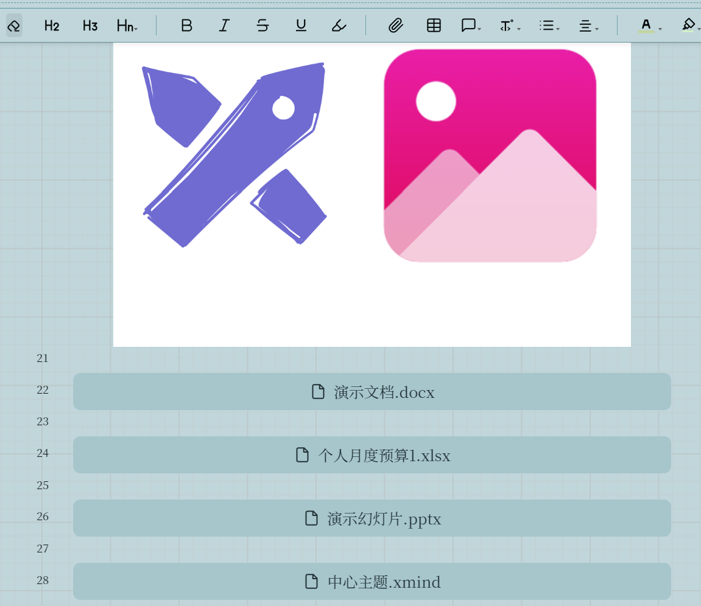
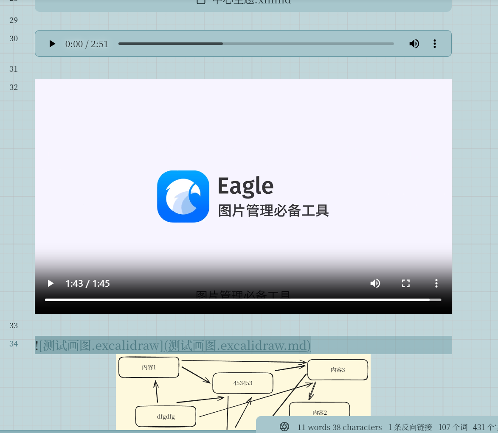
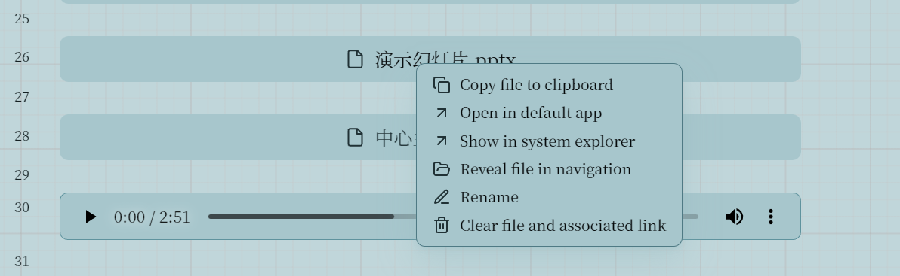
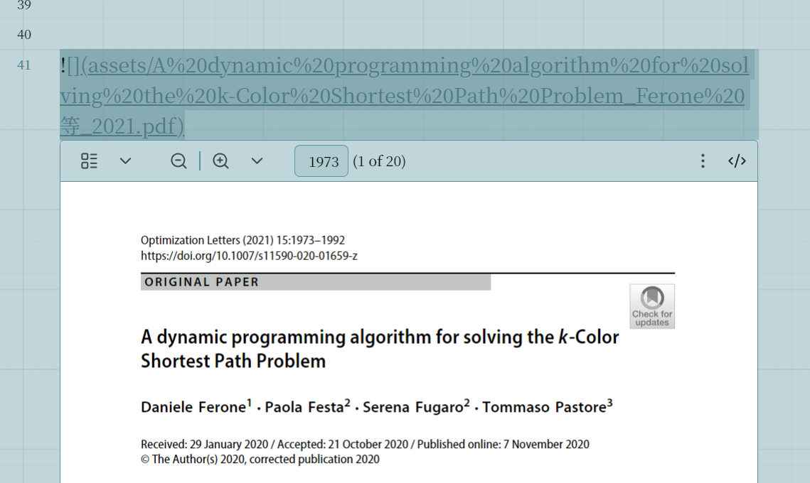
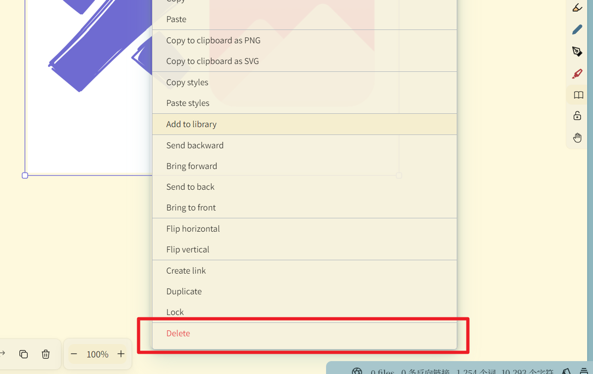
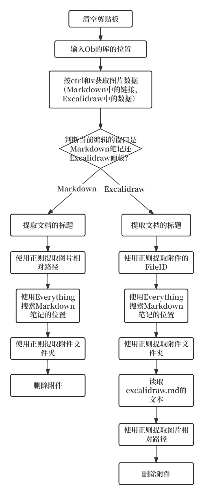
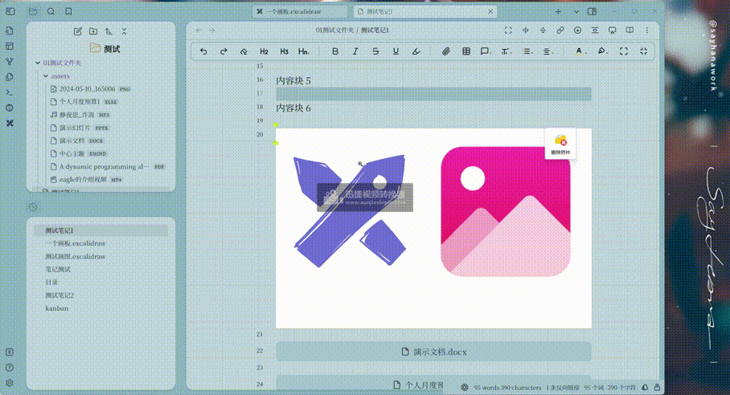
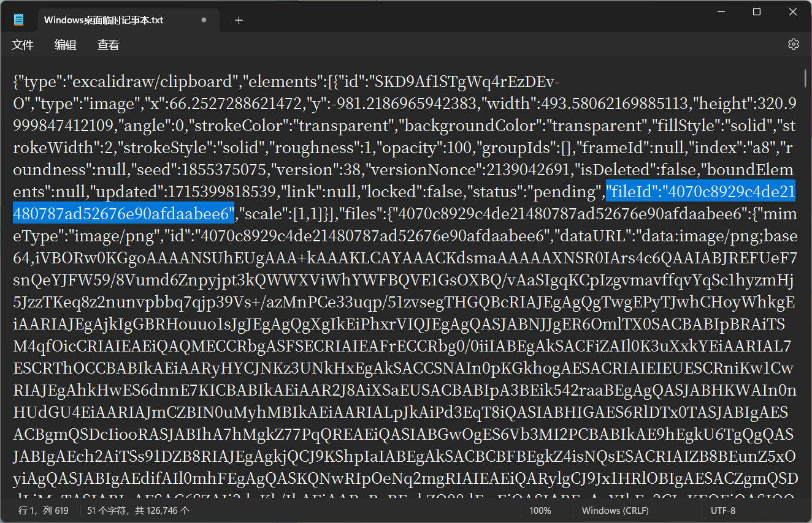
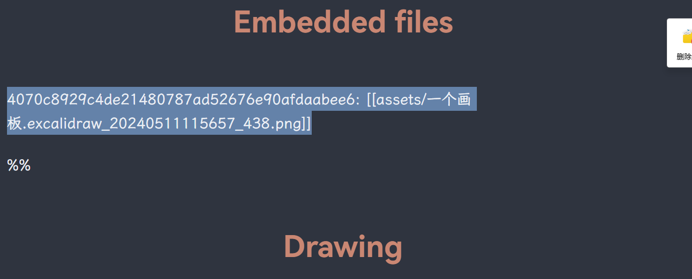
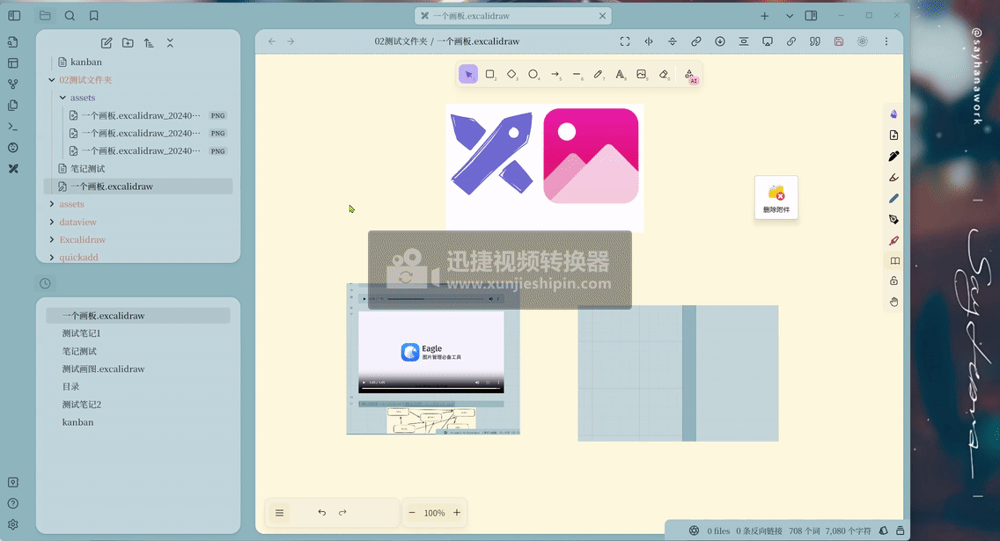

# Delete-Obsidian

知乎文字链接：[用Quicker删除Obsidian的附件与图片](https://zhuanlan.zhihu.com/p/697125669)

哔哩哔哩视频链接：[Obsidian与删除附件](https://www.bilibili.com/video/BV1sx4y1i7q1/?spm_id_from=333.1387.homepage.video_card.click&vd_source=c08c205650a4a5e13d87475ab1ab2431)

## 用Quicker删除Obsidian的附件与图片

### 灵感来源

对于Markdown中的图片、附件管理，B站up主[咬猪娃](https://space.bilibili.com/65972224)的[AttachFlow 插件](https://www.bilibili.com/video/BV1xM4m1R7u2/?spm_id_from=333.999.0.0)可以完美解决复制、删除等问题。

该插件对于图片、Word、Excel、PPT、xmind、pdf、音频、视频、Excalidraw文件都能很方便的管理。

右键附件后会出现一个菜单：

选项依次为：    
1. 复制文件到剪贴板；
2. 在默认应用中打开；
3. 在系统文件夹中显示；
4. 在左边的导航栏中显示；
5. 重命名；
6. 删除文件以及相关链接。

### 问题与需求

但是，Markdown中的pdf文件，虽然也是以图片的方式展示的，但是右键不会打开菜单。

如果需要删除pdf文件的话，就需要去找目录里的源文件删除。

其次，该插件无法在Excalidraw画板中用。如果直接右键删除图片的话，仅会删除画板中的图片，但不会删除文件目录中的图片。

所以我想能不能做一个Quicker动作，专门删除附件，配合AttachFlow 插件就能实现完美的体验了。

### 解决办法

#### Markdown中的附件

[AttachFlow 插件](https://www.bilibili.com/video/BV1xM4m1R7u2/?spm_id_from=333.999.0.0)已经能实现很好的删除效果了，推荐使用。

这里的Quicker动作主要起到补充删除pdf的作用，当然也可以用来删除其他类型的附件。

制作Quicker动作的思路：

对于Markdown中的附件，首先找到当前笔记所属的文件夹，然后在该文件夹的附件文件夹中，找到对应附件，最后删除。

注意删除时需要选中链接，如：

``

起作用的其实是assets/2024-05-10_165006.png，但是为了方便还是全部选中吧。

演示：

可以看到随着删除附件，左边导航栏中的附件在逐渐较少。

#### Excalidraw

图片拖入Excalidraw，会复制进来到附件文件夹。其他文件，如：pdf、视频、音频拖入Excalidraw，则会创建绝对路径，基于本地电脑。所以在Excalidraw中删除附件的操作只针对图片。

制作Quicker动作的思路看参考上面的思路图。

Excalidraw本质是md文件，复制里面的图片实际上是复制文本。

从文本中可以找到附件的“fileID”，
然后以Markdown打开Excalidraw文件，可以发现该“fileID”对应文件的相对路径。只需要将Excalidraw文件转换为文本文件，然后根据“fileID”提取附件路径即可。

找到当前笔记所属的文件夹，然后在该文件夹的附件文件夹中，找到对应附件，最后删除。
演示；

我将Quicker动作、不同的摘录情况的调试运行详情放到了[github仓库](https://github.com/operations4304/Delete-Obsidian)。

[AttachFlow 插件](https://www.bilibili.com/video/BV1xM4m1R7u2/?spm_id_from=333.999.0.0)已经够用了，这篇文章主要是给大家提供思路，大家如果要使用的话得修改一下动作，因为每个人的附件管理方式可能不一样。

我的附件管理方式：[Obsidian附件管理方式](https://zhuanlan.zhihu.com/p/690376509)。

谢谢观看！
